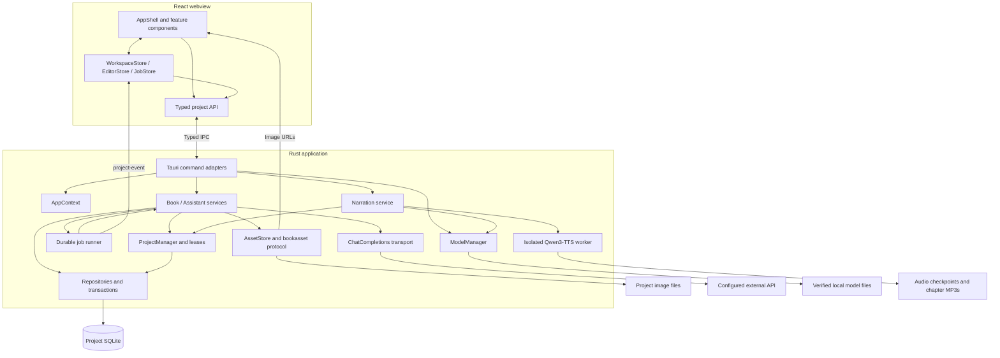
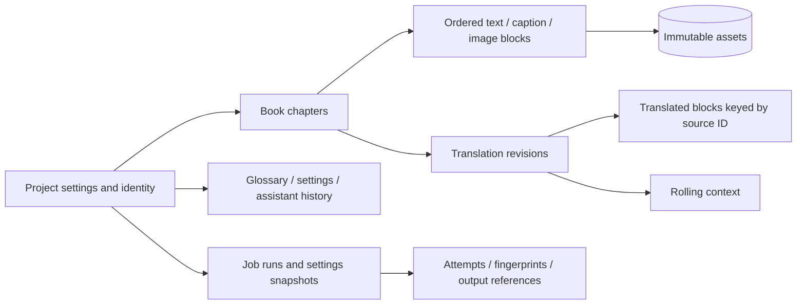
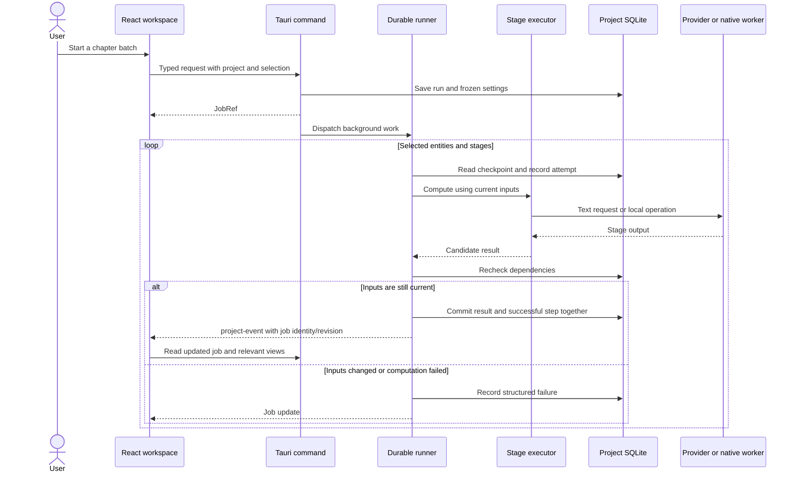
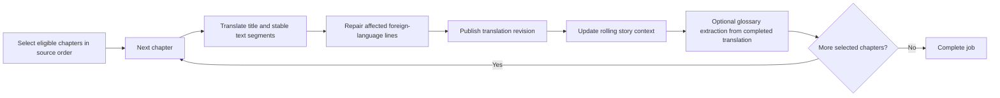
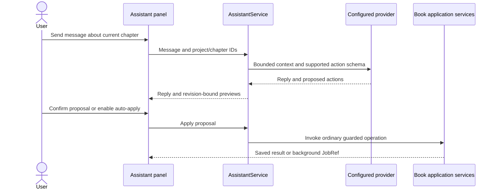

# Architecture

Book Converter is a local desktop application. React renders the workspace inside
Tauri; Rust owns project data, file access, provider requests and background jobs.
Project lifecycle, settings, glossary, assets and execution infrastructure serve book workflows.

## Component boundaries



`AppContext` is the composition root. It owns `ProjectManager`, job admission and
cancellation registries, edit previews, `AssistantService`, `ModelManager` and
`Narration`.
Commands adapt IPC arguments and responses; domain behavior lives in application
services.

Code entry points:

- [AppShell.tsx](../src/app/AppShell.tsx) composes project navigation, workspaces,
  supporting panels and Jobs. [features](../src/features/) contains feature UI.
- [shared/state](../src/shared/state/) handles workspace response ordering, editor
  saves and job subscriptions.
- [transport.ts](../src/shared/api/transport.ts) defines the typed frontend API;
  [desktop.ts](../src/shared/api/desktop.ts) binds it to Tauri or development fixtures.
- [lib.rs](../src-tauri/src/lib.rs) registers commands, plugins, resources and startup
  recovery. [commands](../src-tauri/src/commands/) is the IPC boundary.
- [application](../src-tauri/src/application/) implements domain workflows.
  [project](../src-tauri/src/project/) owns import, manifests, archives and leases.
- [storage](../src-tauri/src/storage/) owns SQL, result revisions and durable records.
  [assets.rs](../src-tauri/src/assets.rs) serves images; [assets/store.rs](../src-tauri/src/assets/store.rs)
  publishes immutable content-addressed files.
- [ai](../src-tauri/src/ai/) handles provider requests.
- [models](../src-tauri/src/models/) downloads and verifies pinned speech model files.
  [narration](../src-tauri/src/narration/) snapshots book text, runs audio jobs and
  exports MP3s. [worker.py](../scripts/tts/worker.py) performs offline synthesis and encoding.
- [book](../src-tauri/src/book/) parses book formats and [export](../src-tauri/src/export/)
  writes output formats.

## Contracts and frontend state

Rust DTOs in [app/contracts.rs](../src-tauri/src/app/contracts.rs),
[app/requests.rs](../src-tauri/src/app/requests.rs) and
[narration/contracts.rs](../src-tauri/src/narration/contracts.rs) generate
[generated.ts](../src/shared/contracts/generated.ts). Revisions cross IPC as decimal
strings, avoiding JavaScript integer precision loss. Requests identify projects and
entities with stable IDs; mutations carry expected revisions.

Errors retain `code`, `messageKey`, `params` and `retryable` across IPC.
[strings.ts](../src/app/strings.ts) turns them into localized messages, including
provider HTTP errors, malformed glossary responses and language failures.

`WorkspaceStore` ignores late responses after project/chapter selection changes.
`EditorStore` coordinates save/discard operations. `JobStore` subscribes before its
initial job listing, reads updated jobs on events, and rejects older revisions.
It does not continuously poll unchanged jobs. UI preferences and selected locations
can live in local storage; persisted project content remains authoritative in SQLite.

Narration uses separate `audio_*` commands and JSON-backed job views. While mounted,
`BookNarration` polls setup and audio job status every 1.5 seconds after the previous
request completes. These jobs do not pass through `JobStore` or `project-event`.

Shared modal windows keep their header/footer outside the scrolling body. Jobs uses
one fixed header/progress area and a scrolling list with active work first.

## Persistent data

The data root is resolved by [paths.rs](../src-tauri/src/paths.rs):
`$XDG_DATA_HOME/book-converter`, otherwise `$HOME/.local/share/book-converter`;
without either environment variable it falls back to a temporary directory.

```text
book-converter/
  settings.db              Application settings, profiles and credentials
  tts-models/              Shared speech model artifacts and partial downloads
  audiobooks/<project-id>/<job-id>/
    input.json             Frozen text, voice, language and device
    status.json            Audio job progress and failure state
    model-files.json       Pinned model file specifications
    model/                 Temporary model hard links or copies
    chunks/                PCM checkpoints and integrity receipts
    audio/                 Chapter MP3s and integrity receipts
  logs/                    Rotating diagnostic logs
  staging/                 Temporary imports and archive snapshots
  projects/<project-id>/
    project.json           Versioned manifest and project identity
    project.db             Domain data, revisions, jobs and history
    assets/                Images addressed by content hashes
```

The manifest format and database schema use version 1. Unsupported manifests/schema
versions are rejected. Project kind and source/target languages are fixed at creation.
Imported text and registered images are self-contained; reading does not depend on
keeping the original source archive at its old location.



See [schema.sql](../src-tauri/src/storage/schema.sql) and
[schema_extensions.sql](../src-tauri/src/storage/schema_extensions.sql) for actual
constraints. Connections enable foreign keys, WAL and a busy timeout. Leases keep
projects alive while work runs; deletion seals the project against new leases,
cancels work and waits for current users before removing its directory.

## Import, images and portable archives

Import first normalizes a source into a staging project and returns a preview.
Creation assigns project choices and publishes the staged directory. Archive paths,
file counts/sizes and image dimensions are validated; folder import rejects symlinks.
Book block IDs preserve separate occurrences even when image bytes
share one asset hash.

Images are loaded through `bookasset` URLs rather than serialized as large IPC
responses. The backend resolves project identity and asset paths inside the project's
asset directory. Changed images get new asset IDs, so cached URLs cannot silently
show different bytes.

`.bcproj` export uses a SQLite snapshot plus its referenced assets and manifest.
Import validates this portable representation before publication. Credentials,
model weights and narration jobs/audio live outside the project directory and are
not archived. Audio must be exported separately from Narration.
Book format export uses a consistent snapshot and an explicit incomplete-book policy.
It replaces an existing destination only after explicit overwrite confirmation and
successful output preparation. Narration export always creates a new directory and
refuses an existing destination.

## Translation background execution

A run freezes entity selection, processing settings, provider configuration and
instructions. A step records its entity, stage, attempt, input fingerprint and output
reference. The runner is independent of the webview and works with `StepExecutor`
implementations for books.



Resume skips successful steps only when their fingerprints and domain validity checks
still match. Changing relevant inputs makes affected work run again. Startup marks
unfinished runs as interrupted; it does not automatically submit new provider calls.
Cancellation preserves already committed steps. Duration measurements feed ETA;
errors are saved with the failed job/attempt.

The shared HTTP transport calls an OpenAI-compatible `/chat/completions` endpoint,
with configured timeout and bounded network retries. Requests are non-streaming.
HTTP 429 and server errors are retryable; domain output validation is handled by the
calling service. Credentials are resolved locally and excluded from run snapshots;
resume checks the saved provider against the configured credential destination.

## Book processing



Images retain their source positions while translated text is keyed to stable source
block IDs. Translation prompts include relevant terminology, book/chapter instructions
and preceding continuity. Missing/duplicated segment results get bounded repair
attempts. Reference imports supply full translations only for aligned chapters that
can accept them without replacing existing authored work.

Glossary extraction stores returned terms without term-count caps; repeated source
terms share one glossary entry. A term without a literal source match can be kept
with zero frequency. Existing targets, including pinned choices, are retained during
additive extraction. Context payload selection is separate from stored glossary size.

Metadata generation translates title/author/annotation into the project's target
language. Supported-script checks trigger language repair and reject unresolved
foreign-script output. These checks are not universal language detection. Manual
presentation overrides remain separate from generated metadata.

## Local narration execution

Narration has its own file-based checkpoints and one active worker across all projects.
Starting a job acquires a project lease and snapshots the selected original or complete
translated text inside a database transaction. The snapshot contains bounded fragments,
language, voice and requested device. Later edits do not alter that input; resuming
reuses the snapshot and verified audio rather than applying translation fingerprints.

`ModelManager` downloads the pinned model bundle with resumable transfers and checks
sizes and SHA-256 hashes. Each job materializes the expected model layout with hard
links where possible and copies otherwise. The runtime validates the frozen executable
at job admission; the Python worker rechecks model files and loads them in offline mode.
Debug builds can fall back to the prepared development virtual environment.

The worker emits JSON progress events on stdout; Rust persists them in `status.json`.
Generated fragments are temporary PCM checkpoints, joined through one continuous LAME
encoder per chapter. Verified chapter MP3s replace their fragment checkpoints. Export
rechecks MP3 hashes and writes a chapter playlist. Finished jobs release their temporary
model directory while keeping the input, status, model specification and chapter audio.

Pause or project deletion stops the child process; parent-pipe monitoring also stops
it when the application exits unexpectedly. On listing a saved running job with no
active worker, the service marks it interrupted. Resume is always explicit. Project
deletion removes its narration directory after cancelling work and releasing leases;
shared weights and exported MP3 folders remain. See [Narration](NARRATION.md) for
user workflows, runtime preparation and manual verification.

## Assistant actions



The assistant has a finite action set and uses the same services as direct UI edits.
History is persisted; pending proposals live in memory and expire. It cannot bypass
revision checks or change a project's fixed languages. See [Assistant](ASSISTANT.md).

## Invariants for changes

Keep source images immutable, distinguish status from result freshness and review,
and validate captured revisions before publishing asynchronous results. Keep API keys
out of project archives, job snapshots and frontend responses. Starting processing is
an explicit action; viewing, capability inspection and selecting a chapter do not submit
paid work. Commands validate project identity before processing.

[Development](DEVELOPMENT.md) describes checks for these boundaries. Automated fixtures
verify application behavior; provider quality, font coverage and native packaging
must also be checked on the relevant content and target platform.
