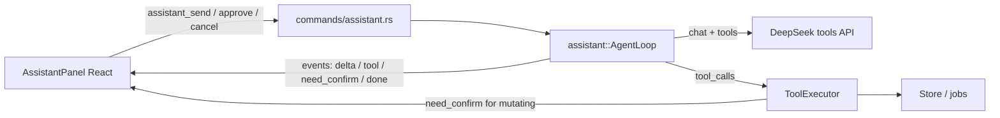

# Plan: Project Assistant (правый чат)

> Living design doc. Started 2026-09-18. Implementation landed in stages;
> keep editing this file when the design evolves.
>
> Decisions locked so far:
> - **Agency:** full agent with tool-calling; dangerous steps need user confirm.
> - **Model:** same DeepSeek API key / model as Settings (`Config::load`).

## Goal

Cursor-like helper on the right: knows the current project (progress, chapters,
glossary, settings) and **itself** calls tools (`start_translation`, glossary
fixes, chapter search/edit, etc.), with explicit confirmation for dangerous
steps.

## Architecture



**Where logic lives:** new Rust module `src-tauri/src/assistant/` (UI-agnostic
core). React is only the dock UI, history, confirm/tool cards, and refresh after
mutations. Do not duplicate business logic on the frontend.

**Why not “frontend invoke as tools”:** one agent loop, one confirm policy, one
system prompt; the frontend does not own the multi-turn tool protocol.

## UI (right dock)

Current layout in [`src/App.tsx`](../src/App.tsx):
`activitybar | sidebar | rightcol(editor + console)`.

Add:

```
activitybar | sidebar | rightcol | [resize] | assistantDock
```

- New button in [`ActivityBar.tsx`](../src/components/shell/ActivityBar.tsx)
  (chat icon), hotkey `Mod+L` (Cursor-like), View menu entry.
- Component `AssistantPanel`: message list, input, Clear, status
  (“thinking / tool / waiting for confirm”).
- Width via existing [`ResizeHandle`](../src/components/common/ResizeHandle.tsx),
  persist in `localStorage`.
- Message kinds: user / assistant / tool-call chips / confirm cards
  (Approve / Deny).
- After a successful mutation — targeted refresh of existing hooks
  (`loadChapters`, `refreshGlossary`, `refreshProgress`, `openChapter`), not a
  full project reload.

## Backend: agent loop

New files (approx.):

| Path | Role |
|------|------|
| `assistant/mod.rs` | facade + types |
| `assistant/prompt.rs` | system prompt + context snapshot |
| `assistant/tools.rs` | JSON Schema tools + allowlist |
| `assistant/executor.rs` | dispatch → Store/jobs |
| `assistant/session.rs` | SQLite history, cancel |
| `commands/assistant.rs` | IPC |
| `translator/deepseek.rs` | extend: `tools` / `tool_calls` (today: prose/json only) |

**Loop:**

1. Build messages = system(snapshot) + history + user.
2. `DeepSeekClient::chat_tools(...)` (OpenAI-compatible function calling —
   [DeepSeek docs](https://api-docs.deepseek.com/guides/function_calling)).
3. If `tool_calls` → for each: auto-run **or** emit `assistant_need_confirm` and
   wait for `assistant_approve` / deny.
4. Append `role=tool` results; repeat until final text or step limit (e.g. 8).
5. Persist turn in project DB; emit `assistant_done`.

**V1 without token streaming** (same as current client: `stream: false`). The UI
streams agent *steps* (tool pending/result), not tokens. SSE is a follow-up.

## Project context (what it “knows”)

**Always in the system snapshot (compact):**

- project id/name, source/target lang, model
- progress: done/pending/failed/running, next_number
- open chapter (idx, number, title, status, lang_issues)
- glossary size + 5–10 recent/pinned conflicts (not the whole glossary)
- reference stats, if any

**Via tools (on demand):**

- `get_progress`, `list_chapters` (slice / filter), `get_chapter` (truncate huge bodies)
- `search_book`, `get_glossary_page`, `chapter_terms`
- mutations (see below)

Never dump the entire glossary or all ~1354 chapters into the prompt.

## Tool allowlist and confirm

| Class | Tools | Behavior |
|-------|-------|----------|
| Read | `get_progress`, `list_chapters`, `get_chapter`, `search_book`, `get_glossary_page`, `chapter_terms`, `get_book_details`, `get_reference_info` | auto |
| Job | `start_translation`, `pause_translation`, `translate_chapter` | confirm |
| Glossary | `update_term`, `delete_term`, `retarget_terms`, `harvest_glossary`, `bootstrap_glossary` | confirm |
| Edit | `update_chapter_translation`, `set_chapter_prompt`, `set_chapter_context`, `replace_in_book` | confirm |
| Heavy | `reset_translation`, `use_reference_as_base`, `export_book` | confirm + strong consequence text |
| Forbidden | `set_api_key`, `delete_project`, `load_source`/`load_reference` (file dialogs), `set_setting` | do not expose |

Confirm UI: card “call `reset_translation(from_number=523)`” → Approve / Deny.
Deny → tool result `"user_denied"`; the agent continues without the action.

While a translation job is already running: mutating tools that conflict with
`begin_job` return a clear error (`job_running`), same as the current UI.

## Persistence

In the project’s `progress.db`:

```sql
CREATE TABLE assistant_messages (
  id INTEGER PRIMARY KEY,
  role TEXT NOT NULL,       -- user|assistant|tool|system_note
  content TEXT,
  tool_name TEXT,
  tool_call_id TEXT,
  created_at TEXT NOT NULL DEFAULT (datetime('now'))
);
```

Commands: `assistant_history`, `assistant_clear`, `assistant_send`,
`assistant_approve`, `assistant_cancel`. History is per-project; clear is
explicit.

## Frontend wiring

- Hook `useAssistant`: history, send, pending confirm, listen to events
  (`assistant_step`, `assistant_need_confirm`, `assistant_done`, `assistant_error`).
- After approve + successful mutate: same refresh paths as
  [`useTranslationJob`](../src/hooks/useTranslationJob.ts) / glossary / book workspace.
- i18n keys EN/RU/ZH for the panel, confirm, errors.
- No active project / Welcome: dock disabled or “open a book”.

## Implementation stages (commits)

1. **UI shell** — dock + ActivityBar + ResizeHandle + empty chat (no backend).
2. **DeepSeek tools** — extend client for `tools`/`tool_calls`; unit-test reply parsing.
3. **Read-only agent** — snapshot + read tools + history; chat already useful
   (“how much left?”, “find chapters with ⚠”).
4. **Mutating tools + confirm** — glossary / translation / edit; UI refresh.
5. **Polish** — hotkey, clear, step limit, note in [`ARCHITECTURE.md`](ARCHITECTURE.md).

### Checklist

- [x] UI dock + ActivityBar toggle + resize + hotkey
- [x] Extend DeepSeekClient: tools / tool_calls protocol
- [x] `assistant` module: snapshot, history SQLite, read-only tools + send loop
- [x] Mutating tools + confirm IPC + UI refresh after mutations
- [x] i18n EN/RU/ZH + ARCHITECTURE.md note

## Out of scope (first wave)

- Token streaming (SSE)
- Separate model for the assistant
- Multi-agent / parallel chats
- Autonomous heavy tools without confirm
- Voice input

## Risks

- **Context and cost:** keep the snapshot small; truncate chapter bodies in tool results.
- **Races with translation job:** respect `running` / `chapter_busy`.
- **Hallucinated tool args:** validate JSON on our side before execute; unknown tools → error tool result.
- **Confirm UX:** do not block the whole UI — only the assistant turn waits for approve.

## Changelog

| Date | Change |
|------|--------|
| 2026-09-18 | Initial plan: full agent (1B), same DeepSeek key (2A), staged delivery. |
| 2026-09-18 | First implementation: dock UI, DeepSeek tools, agent loop, confirm gate, i18n. |
