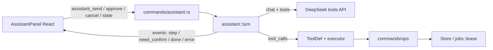

# Plan: Project Assistant (правый чат)

> Living design doc. Started 2026-09-18. Implementation landed in stages;
> keep editing this file when the design evolves.
>
> Decisions locked so far:
> - **Agency:** full agent with tool-calling; dangerous steps need user confirm.
> - **Model:** same DeepSeek API key / model as Settings (`Config::load`).
> - **Ops:** mutating tools call `commands/ops`, not a copy of `commands/`.
> - **History:** `state::assistant` owns `assistant_messages`; no `Store::conn()`.

## Goal

Cursor-like helper on the right: knows the current project (progress, chapters,
glossary, settings) and **itself** calls tools (`start_translation`, glossary
fixes, chapter search/edit, export), with explicit confirmation for dangerous
steps.

## Architecture



**Where logic lives:** `src-tauri/src/assistant/` is UI-agnostic (prompt, tool
table, turn loop, confirm runtime). Business mutations live in `commands/ops/`
and are shared with IPC. React is the dock UI, history, confirm cards, and
targeted refresh from `invalidates` on tool results.

**Why not “frontend invoke as tools”:** one agent loop, one confirm policy, one
system prompt; the frontend does not own the multi-turn tool protocol.

## UI (right dock)

Layout in [`src/App.tsx`](../src/App.tsx):
`activitybar | sidebar | rightcol | [resize] | assistantDock`

- ActivityBar chat button, hotkey `Mod+L`, View menu, command palette.
- `AssistantPanel`: messages, input, Clear, Stop (also while awaiting confirm).
- Width via `ResizeHandle`, clamp 260–560, persist in `localStorage`.
- After a **successful mutation** the event carries `invalidates`
  (`progress` / `chapters` / `open_chapter` / `glossary` / …). The UI refreshes
  those surfaces only. `open_chapter` flushes the reader draft first.

## Backend: agent loop

| Path | Role |
|------|------|
| `assistant/mod.rs` | facade + `HistoryMessage` + `run_turn` |
| `assistant/turn.rs` | loop, untrusted wrapping, cancel `select!` |
| `assistant/history.rs` | replay stored rows → OpenAI messages |
| `assistant/prompt.rs` | system prompt + compact snapshot |
| `assistant/tools.rs` | `ToolDef` table: schema, policy, invalidates |
| `assistant/args.rs` | typed args + JSON Schema (deny unknown fields) |
| `assistant/executor.rs` | thin dispatch → `commands/ops` / Store |
| `assistant/runtime.rs` | one turn per project, confirm, timeout, cancel |
| `state/assistant.rs` | SQLite history API |
| `commands/ops/` | shared mutations |
| `commands/assistant.rs` | IPC |
| `translator/deepseek.rs` | `chat_tools` |

**Loop:**

1. Build messages = system(snapshot) + last 8 turns (replayed, including tools).
2. `DeepSeekClient::chat_tools(...)`.
3. Validate args **before** confirm. Unknown tools → error tool result.
4. Auto-run or `assistant_need_confirm` (180s timeout → `confirm_timeout`,
   shown in the panel). Confirm for `replace_in_book` / `update_chapter_translation`
   / `export_book` is a human preview (match counts, chapter clip, output path),
   not raw JSON.
5. Persist every role (user, assistant text, assistant `tool_calls`, tool,
   `system_note`). Emit `assistant_done`.
6. Cap 8 steps. Cancel aborts in-flight HTTP via `Notify` + `select!` and
   writes `cancelled` tool results for any outstanding `tool_calls`, so the
   next turn's replay stays a valid OpenAI transcript. Clear chat also
   cancels the in-flight turn first.

Book text in tool results is wrapped in
`<<<BOOK_TEXT untrusted=true>>>` … `<<<END_BOOK_TEXT>>>`.

## Project context (what it “knows”)

**Always in the system snapshot (compact):**

- project id/name, `app_settings.languages` / `app_settings.model` (app-wide)
- `project.format` / `project.encoding`
- progress: done/pending/failed/running, next_number
- open chapter (idx, number, title, status, lang_issues)
- glossary size + sample; reference stats
- `book_prompt` (or `(none)`)

**Via tools (on demand):** the `TOOLS` table in `assistant/tools.rs`.

Never dump the entire glossary or all ~1354 chapters into the prompt.
The lang-issues sample in the snapshot is a SQL page of 12, not a full scan.

## Tool allowlist and confirm

The allowlist **is** `TOOLS`. Missing from the table means the model cannot see
or call it. Policy:

| Class | Behavior |
|-------|----------|
| Auto | run immediately; `invalidates` empty |
| Confirm | card, then run |
| Heavy | card + consequence text (`reset_translation`, `use_reference_as_base`, `export_book`) |

Forbidden IPC (`set_api_key`, `delete_project`, `load_source`, `set_setting`)
is not in `TOOLS`.

`export_book` writes into `projects/<id>/export/` with a backend-chosen
filename (format only from the model). File → Export keeps the native save
dialog.

While a job holds `jobs::lease`, conflicting mutations return `job_running`.
Manual chapter edits still use `chapter_busy` instead of the lease.

## Persistence

In the project's `progress.db` (created with the rest of the schema):

```sql
CREATE TABLE IF NOT EXISTS assistant_messages (
  id           INTEGER PRIMARY KEY,
  turn         INTEGER NOT NULL DEFAULT 0,
  role         TEXT NOT NULL,       -- user|assistant|tool|system_note
  content      TEXT NOT NULL DEFAULT '',
  tool_name    TEXT,
  tool_call_id TEXT,
  tool_calls   TEXT,                -- JSON Vec<ToolCall> on assistant rows
  created_at   TEXT NOT NULL DEFAULT (datetime('now'))
);
```

Commands: `assistant_history`, `assistant_clear`, `assistant_state`,
`assistant_send`, `assistant_approve`, `assistant_cancel`. History is
per-project; clear is explicit. Switching projects restores running/confirm
via `assistant_state`.

## Frontend wiring

- Hook `useAssistant`: history, send, pending confirm, `assistant_state` on
  project switch, events (`assistant_step`, `assistant_need_confirm`,
  `assistant_confirm_expired`, `assistant_done`, `assistant_error`).
- `onInvalidated(areas)` — no regexes over tool names.
- i18n keys EN/RU/ZH for the panel, confirm, timeout, errors.
- No active project / Welcome: dock disabled or “open a book”.

## Implementation stages (commits)

1. **UI shell** — dock + ActivityBar + ResizeHandle + empty chat (no backend).
2. **DeepSeek tools** — extend client for `tools`/`tool_calls`; unit-test reply parsing.
3. **Read-only agent** — snapshot + read tools + history.
4. **Mutating tools + confirm** — via `commands/ops`; UI refresh from `invalidates`.
5. **Polish** — hotkey, clear, step limit, confirm timeout, note in ARCHITECTURE.md.

### Checklist

- [x] UI dock + ActivityBar toggle + resize + hotkey
- [x] Extend DeepSeekClient: tools / tool_calls protocol
- [x] `assistant` module: snapshot, history in `state`, read + mutate tools
- [x] Shared `commands/ops` + `jobs::lease`; confirm IPC + invalidates refresh
- [x] `export_book` writes into the project export folder
- [x] i18n EN/RU/ZH + ARCHITECTURE.md / DECISIONS.md notes

## Out of scope (first wave)

- Token streaming (SSE)
- Separate model for the assistant
- Multi-agent / parallel chats
- Autonomous heavy tools without confirm
- Voice input
- Per-project language pair (see `DECISIONS.md`)

## Risks

- **Context and cost:** keep the snapshot small; truncate chapter bodies; replay
  window is 8 turns, not 40 mixed rows.
- **Races with translation job:** every conflicting mutation takes `jobs::lease`.
- **Hallucinated tool args:** typed structs + `deny_unknown_fields` before confirm.
- **Confirm UX:** only the assistant turn waits; 180s timeout; Stop works while
  awaiting confirm; project switch restores the card via `assistant_state`.
- **Prompt injection:** book text is fenced; mutations still require confirm.

## Changelog

| Date | Change |
|------|--------|
| 2026-09-18 | Initial plan: full agent (1B), same DeepSeek key (2A), staged delivery. |
| 2026-09-18 | First implementation: dock UI, DeepSeek tools, agent loop, confirm gate, i18n. |
| 2026-09-21 | Architecture debts: `state::assistant`, `commands/ops`, `jobs::lease`, ToolDef, holes closed. |
| 2026-09-21 | Snapshot lang-issues via SQL page; confirm preview for replace/update/export; timeout copy in the panel. |
| 2026-09-21 | Book-wide prompt: `set_book_prompt` tool, Overview editor, injected into every chapter translation. |
