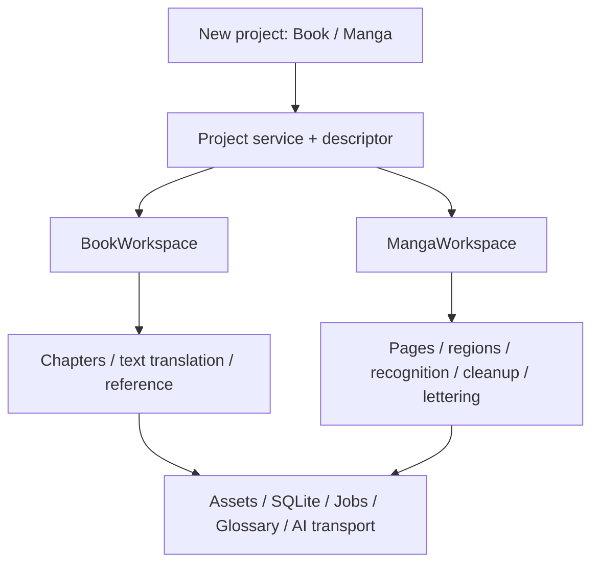

# Manga: a separate project kind and workspace

> Product and architecture proposal, revised 2026-09-23 after inspecting the source.
> This describes the target implementation, not shipped functionality.
> Write repository documentation, code comments and docstrings in English.
> Keep user-facing UI strings localized.

## Implementation plan and precedence

[REFACTORING.md](REFACTORING.md) is the authoritative execution plan for the full
refactor: contracts, schema, structural book translation, phases P00–P13 and agent
handoff. It takes precedence for implementation order and technical boundaries.
This document specifies the manga experience and image-processing requirements.

The application has no external users. The user permits restructuring book
translation and deleting existing test projects, translations and derived project
data during the transition. No legacy project/archive migration is required.
Preserve source books, archives, `samples/`, application settings and API credentials.
The reset is one-shot, after writers stop; never delete projects on every startup.
No data was deleted while preparing these documents.

## 1. Product decision

Before choosing a source file, the launcher offers **Book translation** and
**Manga translation**. These are two project kinds in one application: shared shell,
separate editing experiences, data models and processing pipelines.

Project kind expresses user intent; file format expresses storage. An illustrated
EPUB is not automatically manga. A ZIP can contain a novel or comic pages. Image
counts may support a suggestion but must not silently choose or change project kind.

- `ProjectKind = book | manga`: workflow and available actions.
- `ChapterKind = text | image | mixed | empty`: a book chapter's composition.
- `MangaPage`: an original image, text regions and versioned processing results.
- `Region`: dialogue, narration or a sound effect at a particular location.

A manga page is not a book chapter. EPUB blocks remain useful for illustrated books,
but are not the manga editor's data model. An image can contain words even when the
file has no text layer. The new book pipeline also uses structural blocks and text
segment IDs instead of string `[[img:…]]` placeholders.

## 2. Findings in the current code

- [`Welcome.tsx`](../src/components/Welcome.tsx) exposes only `onOpenBook`.
- [`App.tsx`](../src/App.tsx) always creates book hooks, chapter tabs, search and hotkeys.
- [`useProjectActions.ts`](../src/hooks/useProjectActions.ts) mixes creation,
  activation, reference handling and export; opening triggers book metadata work.
- [`session.rs`](../src-tauri/src/session.rs) has no manifest kind/version;
  write_manifest reconstructs the manifest, potentially dropping future fields.
- [`catalog.rs`](../src-tauri/src/commands/project/catalog.rs) counts chapters and
  skips projects with zero chapters. A proper manga project would disappear.
- [`useProjectList.ts`](../src/hooks/useProjectList.ts) reconciles cached entries
  without refreshing descriptors already known to the UI.
- [`PageSurface.tsx`](../src/components/reader/PageSurface.tsx) is a read-only block
  viewer, not an editor for regions, masks, reading order and lettering.
- [`state/blocks.rs`](../src-tauri/src/state/blocks.rs) ties blocks to chapter indices.
  Its skipped status belongs to the text pipeline.
- [`jobs.rs`](../src-tauri/src/jobs.rs) already separates lifecycle/cancellation from
  runners; retain the useful principle, not necessarily its current implementation.
- [`assets.rs`](../src-tauri/src/assets.rs) supplies immutable-cache URLs. The old
  proposal's `<id>_ru.jpg` fails its current name validation; overwriting any output
  under an unchanged URL would also produce stale cached images.
- [`assistant/tools.rs`](../src-tauri/src/assistant/tools.rs) exposes book actions.
  Backend kind/capability checks must accompany any frontend filtering.

The solution is a shared project core and two independent domains. Existing layout
and APIs do not constrain the redesign. Reuse parsers and algorithms when suitable.

## 3. Creating a project

The launcher presents two project-kind cards, recent projects labeled by kind, and
an independent **Open .bcproj project** action. The menu, command palette and sidebar
add action all open the same creation wizard.

1. Select Book or Manga.
2. Select a source. Books retain their supported formats. Initial manga sources:
   CBZ/ZIP, RAR/CBR and folders of JPG/PNG/WebP. Manga-from-EPUB is a later adapter;
   a spine item must not be assumed to equal one image or one page.
3. Review the import. Books show title, chapter count and languages. Manga shows
   volumes, page counts, thumbnails, natural filename order and reading direction.
   Preserve volume directories as volumes; allow correcting the proposed order.
4. Resolve the language pair. The target defaults from settings and is saved to the
   project. Scans require recognition or manual source-language selection; the
   existing text-script detector cannot inspect pixels. Show uncertainty explicitly.
5. Create the project and open its workspace.

Selecting a file does not start full paid processing. Reading a sample page with AI
is an explicit action. Credentials are required for AI stages, not local import or
viewing. New book metadata work is an explicit persisted post-import option as
specified in REFACTORING.md, not an activation effect.

Import uses a staging session: inspect, validate, copy assets, create the database,
then publish. Cancellation removes only that session. Incomplete imports are not
listed as ready projects and can be cleaned up after a crash. Opening a new-format
`.bcproj` restores its kind without asking the user again.

## 4. Separate workspaces

### Book workspace

Keep overview, chapters, textual editing, reference translation, glossary, search
and export. Rebuild the editor around structured blocks so original and translated
text share illustration positions without exposing internal image markers.
This is a book capability, not a prerequisite hidden inside the manga importer.

### Manga workspace

- Left: volumes and a virtualized thumbnail strip with processing state per page.
- Center: page canvas with zoom/pan and fit-width/fit-page. Views: Original,
  Translation and Side by side, with synchronized comparison transforms.
- Inspector: selected region's source, translation, category, reading order,
  geometry and cleanup mask previews, plus lettering settings. Regions and masks
  are generated automatically; a manual region/mask editor is outside this scope.
- Actions: recognize, translate, clean, typeset, review; scope to page/range/volume;
  stop the queue and retry a failed stage.
- Shared assistant panel remains available. Make chat and region inspector
  switchable so they do not reduce the page canvas to an unusable width.

Before a translated render exists, say **Not translated yet**. If showing the
original as a backdrop, label it as original. Do not display raw markers or claim
that a page contains no words before recognition has examined it.

## 5. Shared infrastructure and domain boundaries



AppShell owns chrome and selection; WorkspaceRouter mounts the right component.
Book hooks do not execute in MangaWorkspace. Shared services cover project files,
assets, application settings, glossary, jobs and chat; domain actions remain separate.
Menus, hotkeys and palette commands come from the active workspace.

ProjectDescriptor, ProjectSummary and job envelopes are common. BookChapterView and
MangaPageView are distinct. Do not introduce a giant DTO with dozens of nullable fields.
See REFACTORING.md for directory layout and exact contract responsibilities.

## 6. Manga persistence

Use the same per-project SQLite infrastructure but separate domain tables:

- Volumes: stable ID, title, order and reading direction.
- Pages: stable ID, volume, order, provenance, original asset, canonical dimensions,
  revision. Page identity does not depend on image hash or filename.
- Regions: stable ID, page, reading order, dialogue/narration/sfx, bbox/polygon,
  source, translation, style and revision/manual-edit metadata.
- Masks: page/region association, mask asset and geometry revision.
- Stage results: stage, input fingerprint, versioned output asset or structured
  result, provider/model information and validity.
- Review: decision associated with an exact result revision.

Do not insert manga pages into chapters or bubbles into chapter_blocks. Identical
image bytes may share one asset while representing multiple pages and region sets.
Search operates on region text. Flattened dialogue is a derived prompt/search
projection, not the authoritative record.

Project kind is mandatory in the new manifest. Legacy projects/archives are rejected,
not implicitly treated as books. Existing test materials are re-imported explicitly.
Future schema versions can have migrations; migration from the current test schema
is deliberately out of scope.

## 7. Processing and partial reruns

```text
Import → recognition of regions/text → dialogue translation
                    ↓                         ↓
              masks → inpainting → lettering → review → export
```

Persist each stage independently. Execution status belongs to job runs/steps;
freshness belongs to results; human approval belongs to review records. A completed
image is not automatically a human-approved page.

- Translation/font edits invalidate lettering, not recognition or inpainting.
- Mask edits invalidate inpainting and lettering, not translation.
- Source text edits invalidate the dependent translation/render.
- Geometry edits invalidate dependent masks/cleanup/layout.
- Rerunning recognition preserves the previous revision and reconciles manual edits.
- Apply a background result only if its input revision still matches. Otherwise it
  remains historical and cannot overwrite newer work.
- Resume completed stages without repeating them. Cancellation must not publish
  partial temporary files as successful results.

Translation context depends on page identity, ordering, glossary revision and
predecessor context. Editing earlier dialogue can mark subsequent results as stale;
never trigger silent paid retranslations. RTL controls reading order, not mirroring.

Initially use one mutating job per project and bounded local execution. Contextual
translation is sequential. Independent recognition/render stages may gain bounded
parallelism later without changing persistence. Show progress by stage and pages,
for example **Translation 8/20; cleanup 5/20**, with measured stage-specific ETA.

## 8. Recognition, cleanup and lettering

Use cloud recognition/translation and automatic local cleanup/lettering, with no
mandatory GPU or heavy local model. Windows, macOS and Linux are required platforms.
[MANGA_TOOLING.md](MANGA_TOOLING.md) records the verified tool assessment, resource
budgets, platform matrix and model acceptance gates. DeepSeek Flash image input is
confirmed by current official documentation; manga accuracy remains unbenchmarked.
A lightweight cleanup model is required; LaMa/ONNX is a candidate, not a frozen
choice. There is no manual or model-free processing mode. Preflight blocks processing
until required models and API configuration are ready. Import/viewing remain available.

Recognition and translation have separate role settings, even if they share one
provider/key. Start with one adapter, not a provider marketplace. Reuse transport
and retry behavior; support multimodal messages without breaking ordinary tool
conversations. Resolve settings explicitly per job.

Recognition produces region IDs, text, geometry, category and reading order.
Translation produces values keyed by region ID, without inventing new geometry.
Even if one provider can combine requests, persist/retry the logical stages separately.

A text bbox is neither a bubble shape nor an erasure mask. Generate validated text masks automatically;
do not erase an entire rectangle and destroy panel art, bubble borders or SFX.
Automatic masks and lettering areas must pass quality gates; failed pages support
review and automatic retry, not a manual processing fallback.

Coordinates refer to canonical EXIF-normalized pixels. Retain the inverse mapping
for API crops/resizes. Lettering stores font ID, size, alignment, line spacing and
stroke. Flag overflow as needs_review instead of silently clipping text. Matching
handwriting or complex SFX styling is not promised in the first release.

## 9. Assets and portability

Originals remain immutable. Cleaned pages, masks, thumbnails and typeset results
have separate asset identities. Durable output uses content-addressed URLs; never
replace bytes under `<id>_ru.jpg`. Bound memory through thumbnails, virtualization,
neighbor prefetch and full-resolution loading only for the active processing stage.

Archive import checks paths, links, file count, expanded size and image dimensions.
Invoke a RAR extractor with argument arrays, not shell interpolation. If unavailable,
allow an extracted folder. Password-required, corrupt and unsupported archives must
have distinct errors. Natural volume/page sorting is reviewed before creation.

Project export bundles the descriptor, a consistent SQLite snapshot and all required
originals, manual edits and results. The current archive path copies the database
file directly while SQLite uses WAL; replace that with a backup snapshot and pinned
asset inventory. Thumbnail cache is reproducible; user masks are not disposable.

Manga output: CBZ and EPUB containing selected ready page revisions in order.
**Ready pages only** and **Include originals for unfinished pages** are explicit
policies. A full export blocks on missing output by default rather than dropping
pages or substituting originals silently. Record page-to-result revision mapping.

## 10. Delivery order and manga acceptance

Follow P00–P13 in REFACTORING.md; this section is not a competing checklist.

1. Build the new project core and a complete book workflow on structural blocks.
2. Add manga import and a useful offline page workspace.
3. Add automatic region detection, mask generation and recognition with previews.
4. Verify one real recognition adapter, then translate regions with context.
5. Add required lightweight model cleanup, lettering and visible overflow handling.
6. Finish batch/resume/review, portable project archives and CBZ/EPUB output.
7. Expose manga assistant tools through the same application services.

Required demonstrations:

- Multi-volume order and page count survive import, reopen and export.
- Local viewing works without credentials and after the source archive is removed.
- Large volumes do not decode every image at once.
- Crop/resize/zoom preserve region positions; repeated OCR preserves manual edits.
- Translation edits rerender only lettering; mask edits do not rerun translation.
- Stale background output cannot overwrite a newer edit.
- Restart resumes from completed stages, with finite retry/cancellation behavior.
- Project archives preserve kind, regions, masks and results under a new project ID.
- Manga assistant tools never dispatch the book translate_chapter operation.
- Validate actual Linux Tauri image loading, not only browser mocks.

## 11. Samples and changes from the original proposal

The original plan named two gitignored samples under `samples/manga/`:

- `完璧な夫には謎がある～レス4年目の事情～ v01.rar`: reportedly 117 JPG pages.
- `神さま学校の落ちこぼれ v01-07.rar`: reportedly about 1248 JPG pages, seven volumes.

Counts are inherited from the original proposal, not independently verified by
unpacking during this planning pass. Keep source samples out of version control.

Retained: typeset output, local processing, glossary/context and representative samples.
Replaced: page-as-chapter, Bubble inside chapter_blocks, a forced model, overwritten
`_ru.jpg` outputs and beginning the implementation inside the old Reader.
The user subsequently removed legacy compatibility requirements and authorized a
full book refactor and one-shot test-project reset; REFACTORING.md incorporates this.
