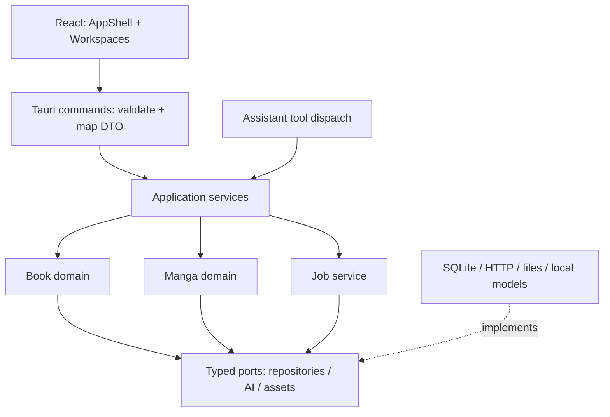

# Full refactoring plan: books and manga

> Execution plan and handoff document for another coding agent.
> Prepared on 2026-09-23 against source HEAD `d636c5d`.
> Execution status: P00 and P01 complete; P02 in progress.
> See [REFACTORING_STATUS.md](REFACTORING_STATUS.md) for current evidence.
> Breaking changes to code, APIs and project storage are explicitly allowed.

## 0. Read this first

This document defines implementation order, technical contracts and acceptance
criteria. [MANGA.md](MANGA.md) supplies manga product requirements and image-processing
constraints. [MANGA_TOOLING.md](MANGA_TOOLING.md) defines the tooling assessment,
resource budgets and cross-platform release gates. If the documents disagree about implementation structure, this plan
takes precedence. Record any new decision here before implementing it, and update
the related documents.

ARCHITECTURE.md, DECISIONS.md, SETTINGS.md and PROJECT_ISOLATION.md describe the old
implementation. Treat them as a feature inventory, not a requirement to preserve
old code. Previous chat statements are not test evidence: run the relevant checks
again in the current environment.

**Language rule:** write all new or modified code comments, docstrings and repository
documentation in English. Keep user-facing UI strings localized in English, Russian
and Chinese. Conversation with the user may remain in Russian. Apply this rule to
status reports stored in the repository and to future handoff documents too.

### Authorized scope

- This is a test application with no external users.
- The user permits redesigning book translation and deleting existing test projects,
  translations, project chat history and derived project data.
- Migration of old databases or old `.bcproj` archives is not required. Reject
  unsupported archives explicitly instead of attempting to interpret them.
- Preserve source books, source archives, `samples/`, the repository, application
  settings and API credentials.
- Choose Book or Manga before importing a source.
- Use a shared shell and infrastructure with separate domain models, workspaces
  and processing pipelines.
- Manga processing is automatic through typeset output. No manual or model-free
  processing fallback; automatic detection, masks and lightweight cleanup are required.
- Support Windows, macOS and Linux; required architectures and release gates are
  defined in MANGA_TOOLING.md. Linux-only validation is insufficient.
- No mandatory GPU, local LLM/VLM or heavy local model. Required local models
  must pass the documented CPU, download and memory budgets.
- Make focused commits after completed implementation slices. Push only when asked.

### Non-goals and prohibited shortcuts

Do not represent a manga page as a fake book chapter. Do not grow the existing
Reader into a conditional editor for every content type. Do not introduce one
universal ContentItem entity for both domains.
Do not persist the same mutable status independently in a manifest, database and
React state. Do not migrate obsolete test databases. Do not rename files en masse
without a working scenario. Do not retain two authoritative write paths after a
phase is complete.

## 1. Current implementation: boundaries to change

### Coupling found in the source

- `src/App.tsx` combines shell, book state, commands, hotkeys, jobs and menus.
- `src/hooks/useProjectActions.ts` combines import/activation, reference handling,
  automatic AI metadata and export.
- `src/hooks/useTranslationJob.ts` models book-specific progress rather than a
  shared job lifecycle.
- `src/types.ts` and `src-tauri/src/dto.rs` mix common and domain contracts.
- `src-tauri/src/commands/ops` is a useful shared action entry point for UI and
  assistant, but application operations live inside the IPC layer.
- `src-tauri/src/state` puts chapters, blocks, glossary, chat and metadata in Store.
- `src-tauri/src/session.rs` combines lifecycle, manifests, layout and validation.
- `src-tauri/src/translator/deepseek.rs` combines transport and provider wire format.
- `src-tauri/src/orchestrator` combines translation, context, glossary, storage
  and progress reporting.
- `assets.rs` depends on a constant from commands. Infrastructure must not depend
  on IPC. The project catalog currently requires chapters to exist.

### Reuse candidates

TXT/FB2/EPUB/PDF parsing, encoding detection, heading detection, paragraph chunking,
search and highlighting, glossary merge rules, language repair, output writers,
project ID validation, the custom asset protocol and UI primitives are candidates.
Reuse them after testing and separating old Tauri/Store dependencies where needed.

Preserve book features, not their implementation: project language pair; translated
title/author/annotation; reference continuation; glossary; rolling context; manual
editing; chapter/book instructions; search/replace; reset/retarget; illustrations;
progress; export; assistant chat.

## 2. Target architecture and dependency rules



Domains must not import Tauri, React, commands or global mutable settings. Services
receive an explicit project context and dependencies. Commands are thin adapters;
assistant tools call the same services and obey the same kind/revision/policy checks.

Keep one Rust crate, one React application and one database per project. No
microservices, DI framework or plugin platform is needed. Use traits for external
boundaries that need fake implementations in tests, not mechanically for every function.

### Target directories

```text
src/
  app/                  AppShell, WorkspaceRouter, AppProviders, commands
  features/
    projects/           ProjectLauncher, NewProjectWizard, project queries
    book/               BookWorkspace, ChapterEditor, book queries/actions
    manga/              MangaWorkspace, PageCanvas, PageStrip, RegionInspector
    glossary/           shared term list and editor
    assistant/          chat, events, active-workspace context
    settings/           UI settings and AI profiles
  shared/
    api/                single invoke/listen adapter and errors
    contracts/          domain-separated DTOs and events
    jobs/               shared job store and subscriptions
    ui/                 Modal, VirtualList, ResizeHandle, design tokens
    lib/                independent helpers
    i18n/               en/ru/zh, feature-scoped keys

src-tauri/src/
  app/                  composition root, config resolution, errors
  project/              descriptor, catalog, staging, lifecycle, archive
  application/          book/manga/glossary/assistant services
  domain/
    book/               model, import normalization, translation, reference, export
    manga/              model, recognition, translation, masks, layout, pipeline
    glossary/           model, merge and rename policies
  jobs/                 registry, durable runs, cancellation, events
  ai/                   typed requests/responses, capabilities, provider adapter
  storage/              connection factory, schema, migrations, repositories
  assets/               registry, immutable writes, protocol, thumbnails
  assistant/            agent loop, history, context, tools and policies
  commands/             DTO validation + delegation, Tauri only
  settings/             existing app settings storage and secret access
```

This is a target layout, not a requirement to create empty modules. Introduce each
module with a working consumer. Large modules may have submodules; moving a monolith
under a new name does not complete a refactor.

## 3. Project identity and persistence

### 3.1 Descriptor and layout

Required manifest fields: `format_version`, `id`, `kind: book|manga`, `name`,
`created_at`, `source: {format, display_name, original_path?}`. The manifest owns
identity and provenance. The database owns content, languages, processing settings
and results. The catalog and frontend read identity through the backend descriptor.

The backend creates project IDs. Entity IDs are opaque, stable UUID strings;
list position and printed chapter number are not identity. Store the active project
by ID, not list index. Languages use stable codes, with display/prompt names resolved
separately. Source language may be unknown before recognition or manual selection.

```text
<app_data>/settings.db                         preserved
<app_data>/staging/<import_id>/                incomplete imports
<app_data>/projects/<project_id>/
  project.json
  project.db                                  new schema
  assets/<sha256>.<ext>                        originals and durable derivatives
  cache/                                      reproducible thumbnails
```

Start the new schema at version 1. Never open an old progress.db as a new project.
Write manifests atomically and preserve fields when renaming. Publish a completed
staging directory by rename on the same filesystem. The catalog only lists valid,
published manifest/database pairs.

### 3.2 Common database schema

Enable foreign_keys, WAL and busy_timeout on every connection. Define foreign keys,
intentional ON DELETE behavior, uniqueness, checks and indexes in SQL migrations.
Do not carry over silent ALTER failures or unchecked default values.

- `project_settings`: language pair, processing profile references, domain options,
  settings revision.
- `assets`: hash ID, relative path, MIME, byte length, dimensions; bytes are immutable.
- `glossary_terms`: ID, source, target, kind, pinned, frequency, revision.
- `glossary_state`: monotonic revision of the whole glossary.
- `job_runs`: ID, kind, state, settings snapshot, timestamps, terminal error.
- `job_steps`: run ID, typed entity reference, stage, attempt, input fingerprint,
  state, output reference, duration, error. Validate domain references in services.
- `assistant_messages`: project-local history; never store credentials or full-size
  image payloads in the transcript.

Do not store incomplete output as a successful result. Write bytes to a temporary
file, publish an immutable asset, then commit the result reference transactionally.
An orphaned file after a crash is recoverable through GC; a successful database
reference to a missing file is not acceptable.

### 3.3 Books: structural blocks replace string markers

- `book_chapters`: ID, position, optional display number, source title, revision,
  instructions.
- `book_source_blocks`: ID, chapter ID, position, kind=text|image|caption, text or
  asset ID. CHECK constraints reject incompatible payloads.
- `book_translations`: ID, chapter ID, source revision, status, provenance, target
  language, translated title, context fingerprint, glossary revision, revision.
- `book_translation_blocks`: translation ID, source block ID, translated text.
  Resolve illustrations from source blocks by ID and position.
- `book_contexts`: chapter ID + translation revision, summary, previous tail,
  predecessor context reference. Context belongs to a particular version.
- `book_reference_*`: imported reference text and explicit chapter mapping. Matching
  numeric indices alone is not proof that two chapters correspond.

Structural blocks are authoritative. Plain text for search/prompts is a projection.
Plain-text books also have blocks; do not keep an independently mutable source string.
Start with SQL/text projection search; add FTS only if measurements justify it.

The translator receives ordered text segments with stable IDs. Its response must
contain exactly the requested IDs and translated values. Images are not submitted
to the text model or encoded as `[[img:…]]`; their positions are not reconstructed
from paragraph ratios. A long source block produces deterministic segment IDs and
assembly order. Validate missing, duplicate and unknown IDs; repair only invalid
segments. Network retries and structural-output retries have distinct finite limits.

The editor updates text by block ID and expected revision. Visually, a chapter is a
continuous document with illustrations between text blocks. Selection, search,
hotkeys and autosave operate on blocks, not hidden markers in a textarea. A first
implementation may use textareas for individual text blocks with coordinated
save/debounce behavior. Introduce a rich-text framework only for a concrete need.

### 3.4 Manga

- `manga_volumes`: ID, position, title, reading direction.
- `manga_pages`: ID, volume ID, position, original asset ID, dimensions, revision.
- `manga_regions`: ID, page ID, reading order, dialogue|narration|sfx, polygon/bbox,
  source text, translated text, text/style revisions, manual-edit flags.
- `manga_masks`: ID, page/region ID, asset reference, geometry revision.
- `manga_results`: page ID, stage, input fingerprint, result revision, output asset
  or structured payload, provider/model version, validity.
- `manga_reviews`: page ID, result revision, unreviewed|needs_review|approved, issues.

A stage result is a durable artifact; a job step is an attempt to compute it.
Original pixels are immutable. Identical bytes appearing twice still represent two
pages. Coordinates refer to the canonical EXIF-normalized image, not the viewport.
API resize/crop operations retain an inverse transform. Text bounds, cleanup masks
and lettering areas are separate concepts, not three uses of one bbox.

## 4. Shared execution infrastructure

### Jobs

Run/step states: queued, running, succeeded, failed, cancelling, cancelled,
interrupted. Stale is a result property derived from input dependencies, not a job
failure. On startup, persisted running work becomes interrupted. Resume only
unfinished or invalidated steps. A successful translation must not run again merely
because summary generation failed.

One mutating pipeline run per project; different projects may run concurrently.
CPU tasks use a bounded executor and network requests use bounded concurrency and
backoff. Limits must be explicit and tested. Never decode a whole volume into memory
or hold a SQLite transaction across HTTP or inpainting work.

Manual editing during a run is supported through optimistic concurrency. Late
responses cannot overwrite newer data. Switching projects does not cancel jobs.
Deletion requests cancellation, waits for jobs/assistant/writers to finish and
closes connections before removing the project directory.

### Fingerprints and invalidation

Include source revision/hash, language pair, stage options, prompt/schema version,
provider/model ID and dependency versions in the fingerprint. Exclude secrets.

For books, editing an earlier translation/order invalidates dependent context.
Mark later results for review instead of silently issuing paid retranslations.
For manga: translation/style invalidates typesetting; masks invalidate inpainting
and typesetting; source/geometry invalidates dependent translation/masks/layout.
Repeated OCR preserves manually corrected regions through reconciliation.
Glossary changes mark dependent results stale/needs_review; bulk retarget is an
explicit operation with an affected-location preview.

### AI and settings

Separate transport from domain prompts. Contracts: TextRequest, StructuredRequest,
VisionRequest and ToolConversation. Responses retain finish reason, usage and
provider errors. Processing roles: book_translation, manga_recognition,
manga_translation, assistant. Roles may share a provider but never silently change
one another's model.

Configuration precedence: defaults → app preferences → explicit project processing
choices. Credentials/endpoints may have documented environment overrides displayed
as locked settings. SOURCE_LANG/TARGET_LANG must not silently change existing projects;
treat them as creation defaults or explicitly resolved settings.
Settings APIs never return full credentials; `.bcproj` never contains secrets.

Do not trust old documents for current vision support, model names or API limits.
At integration time check official provider documentation and run a small opt-in
smoke request. Use fake providers for normal tests; no paid calls in the test suite.

## 5. IPC and event contracts

Rust DTOs are canonical. On P01 choose and pin a TS generation approach (for example,
ts-rs after verifying a suitable version), plus a command that detects generated
contract drift. Do not keep independently edited Rust and TS definitions.

Return `Result<T, AppError>`. Errors carry code, messageKey, params, retryable and
optional sanitized details. UI localizes messageKey; diagnostics are separate.
Mutations accept expectedRevision and return a new revision. Conflicts refresh the
view or request reconciliation rather than repeatedly overwriting current data.

Target command contracts; define exact argument schemas in P01 DTOs:

- `project_list() -> ProjectSummary[]`: kind and domain-specific progress.
- `project_inspect_source(kind, path) -> ImportPreview`: creates an import session,
  not a published project.
- `project_create(importId, choices) -> ProjectDescriptor`: idempotent by importId.
- `project_cancel_import(importId) -> void`.
- `project_open(projectId) -> ProjectDescriptor`: no implicit AI/OCR work.
- `project_delete(projectId) -> JobRef` or a completed result after quiescence.
- `project_archive_export/import(...)`: new format version and consistent snapshot.
- `book_list_chapters(projectId, cursor?, limit) -> ChapterPage`.
- `book_get_chapter(projectId, chapterId) -> BookChapterView`.
- `book_update_block(projectId, blockId, text, expectedRevision) -> BlockView`.
- `book_start_translation(projectId, selection, options) -> JobRef`.
- `book_reference_import`, `book_replace_preview/apply`, `book_export`.
- `manga_list_pages(projectId, volumeId?, cursor?, limit) -> PageSummaryPage`.
- `manga_get_page(projectId, pageId) -> MangaPageView`.
- `manga_update_region/mask/order(...expectedRevision) -> UpdatedView`.
- `manga_start_stage(projectId, selection, stage, options) -> JobRef`.
- `manga_review_page(projectId, pageId, resultRevision, decision)`.
- `manga_export(projectId, selection, format, incompletePolicy) -> JobRef`.
- Shared `job_get/list/cancel/resume`, `glossary_*`, `assistant_*`, `settings_*`.

Selection is all, explicitIds or a range with stable boundaries. Resolve and persist
the selected IDs at run creation so later sorting changes cannot change the job.
Manga commands take page/region IDs, never legacy chapter indices.

Events use `{version, projectId, jobId?, seq, type, payload}`. Sequence numbers are
monotonic per job. On reconnect request a snapshot; events only update that snapshot.
Types: job.updated, entity.changed, glossary.changed, assistant.updated. Invalidation
includes entity ID and revision. Events are not durable storage. Coalesce frequent
progress updates. Late responses for an inactive project update its keyed job store,
not the active workspace.

## 6. Frontend and user flows

AppShell owns chrome and project selection. WorkspaceRouter mounts BookWorkspace
or MangaWorkspace keyed by project ID. Domain hooks run only in their workspace.
The shared job store and subscriptions live above the router so background jobs
survive workspace switches.

Use one invoke/listen adapter; components call feature APIs/hooks. Cache queries by
projectId + entityId. Narrow hooks and a store are sufficient initially; do not add
a state library without explaining its need. Use abort/generation guards for loads,
unsubscribe on unmount and coordinate autosave flushing.

Creation: kind → source → preview/order/languages → create. No API key is required
for local viewing; paid stages are separate. A book post-import metadata job may be
an explicit wizard option, enabled by default when credentials exist. Persist it as
a job, never restart it on every open. This preserves automatic title/author/summary
translation without hidden repeated requests.

BookWorkspace: overview, chapters, structural editor, reference, glossary, search.
MangaWorkspace: volumes, page strip, zoom/pan canvas, comparison, region inspector,
masks, translation/layout, queue/review. Chat and inspector are switchable panels.
Support en/ru/zh, keyboard focus and accessible labels.

Assistant mode never bypasses backend validation. Filter tool schemas by kind and
capabilities, and execute through application services. Auto-run permits ordinary
writes; destructive policy stays explicit. Previews show the meaningful operation,
not JSON/internal paths. Context uses chapterId or pageId/regionId as appropriate.

## 7. Import, assets, archives and export

One AssetStore for both domains: atomic writes, SHA-256, MIME validation, dimensions,
immutable originals, reference checks. URLs depend on content hash, not a `_ru`
suffix. Thumbnail cache is separate from user masks and durable output.

Import adapters return normalized domain data, not direct database writes.
Book adapters cover TXT/FB2/EPUB/PDF and supported ZIP entries. Manga adapters cover
CBZ/ZIP, folders and RAR/CBR. Use natural sort with preview; preserve volume identity.
Apply staging limits for file count, bytes and pixels. Reject path traversal and
symlinks; do not interpolate shell commands. Do not unpack the archive into RAM.
Missing images produce an explicit preview/error decision, not silent page loss.

New `.bcproj`: versioned manifest, SQLite backup snapshot and reachable assets.
Take the snapshot and asset inventory under a short project lock. Asset bytes are
immutable; pin them against GC until packaging finishes. Import creates a new
project ID and preserves relative references. Validate integrity before publishing.

Book export consumes blocks directly. EPUB/FB2 embed images; PDF accounts for them
in layout/TOC. TXT uses an explicit illustration omission policy. Manga CBZ/EPUB
exports snapshot the selected result revisions. Do not substitute originals for
unfinished pages without an explicit user policy. Missing content produces an error
report, not a successful export with silently omitted pages.

## 8. Implementation checklist

Each Pxx needs its own progress record and one or more focused commits. Writing
files is not completion: execute the acceptance checks below.

### [x] P00 — Baseline and fixtures

Dependencies: none.

- Read repository instructions, status/diff and all three planning documents.
- Record supported minimum OS versions, required architecture/build matrix and
  baseline CPU/RAM hardware for the MANGA_TOOLING.md resource gates.
- Record actual Rust/Node versions, build/test commands and baseline failures.
- Create small legal/synthetic fixtures: TXT with Chinese and numbered-dot headings;
  FB2 reference; text/image/mixed/repeated-image EPUB; naturally sorted two-volume comic.
- Do not commit real samples. Generate synthetic fixtures deterministically.
- Create `docs/REFACTORING_STATUS.md` with P00–P13 states and evidence (section 10).

Acceptance: reproducible baseline and feature inventory; no data deletion.
Commit: `test: establish refactoring baseline and fixtures`.

### [x] P01 — Contracts and boundaries

Dependencies: P00.

- Add domain IDs, ProjectKind, descriptor, AppError, JobRef/Event and typed selections.
- Define exact DTO schemas and TS generation/check; freeze coordinate/version units.
- Add composition root and a thin command layer with a working project contract.
- Test serialization of kinds, unsupported versions, errors and event envelopes.

Acceptance: synchronized Rust/TS contract; no Tauri imports in pure models.
Commit: `refactor(core): define project and execution contracts`.

### [ ] P02 — New schema and AssetStore

Dependencies: P01.

- Add SQL migrations and repositories for common/book/manga entities.
- Implement transactions, FKs, stable IDs, revision compare-and-swap and immutable assets.
- Remove assets → commands dependency; route the protocol through AssetStore.
- Test dangling references, duplicate bytes vs page identity, revision conflicts,
  invalid paths, atomic registration and repeated-image occurrences.

Acceptance: fresh database works without fake legacy chapters; app settings untouched.
Commit: `refactor(storage): add versioned project schema and asset store`.

### [ ] P03 — Project lifecycle and controlled reset

Dependencies: P02.

- Implement catalog, inspect/staging/create/open/delete and ID-based active selection.
- Provide a one-shot development reset that enumerates exact target directories,
  stops writers, closes connections and removes only old projects and their UI keys.
- Authorization already exists. Ask again only if actual data outside the authorized
  scope is discovered. Never delete settings.db, samples or .env.
- Remove startup cleanup that could repeat the destructive reset.
- Reject old manifests/archives explicitly; do not add a fallback book mode.

Acceptance: cancelled import leaves no published orphan; reset is scoped and one-shot;
application starts empty afterward while settings and sources remain intact.
Commit: `refactor(project): replace lifecycle and reset obsolete test projects`.

### [ ] P04 — Shared jobs and AI transport

Dependencies: P02–P03.

- Implement durable runs/steps, leases, cancellation/resume, revision guard and events.
- Extract HTTP/retry/streaming; add one working provider adapter and a fake.
- Resolve role settings/credentials and snapshot job inputs; enforce finite retries.
- Test interruption after save, cancellation during request, late results after an
  edit, parallel projects and deletion of a busy project.

Acceptance: fake end-to-end job resumes without repeating succeeded steps; no writes
after deletion; stage counters agree with the persisted snapshot.
Separate jobs and AI commits.

### [ ] P05 — Book backend using structural blocks

Dependencies: P04.

- Adapt current parsers/importers to chapter/block IDs and AssetStore.
- Translate segment IDs with validation/repair and deterministic long-block chunks.
- Persist context, glossary extraction and metadata as independent steps.
- Port reference mapping, search/replace preview, retarget, instructions and manual saves.
- Keep illustrations structural; remove marker restoration from the new path.
- Export existing book formats from structured results.

Acceptance: fake text/mixed/image translation; repeated images; missing segments;
long chapters; resume; pinned terms/reference; context invalidation; output roundtrips.
An image-only book page is excluded from the text pipeline because it has no text
layer, not because it necessarily contains no words.
Separate import, translation/context, editing/reference and export commits.

### [ ] P06 — Shell, wizard and BookWorkspace

Dependencies: P03–P05.

- Rebuild App, launcher, wizard, workspace router and background job store.
- Move book UI into its feature and replace string editing with block editing.
- Update menus/hotkeys/palette, glossary, search, overview and all locales.
- Autosave uses expectedRevision; flush before navigation/export; expose conflicts.
- Run the persisted metadata job after create, not an effect on each open.

Acceptance in Linux Tauri: import → languages → metadata → translate → edit → search
→ export. Illustrations appear in both panes. Rapid project switching does not mix
data. Reload preserves saved edits.
Separate shell/wizard, editor and supporting-feature commits.

### [ ] P07 — Assistant through application services

Dependencies: P05–P06.

- Move reusable actions from commands/ops into services.
- Filter tool allowlist/schema/policy/invalidation by project capabilities.
- Reconnect book tools, history, Auto-run and meaningful previews.
- Define typed page/region context without advertising unimplemented manga tools.

Acceptance: GUI and tool actions produce identical results; kind/revision guards
cannot be bypassed; denial writes nothing; transcripts contain no secrets.
Commit: `refactor(assistant): route tools through project services`.

### [ ] P08 — Manga import and page workspace

Dependencies: P04, P06.

- Add comic adapters, volumes/pages, natural sorting and thumbnail generation.
- Implement zoom/pan canvas, comparison, virtualization and inspector/chat switching.
- Add manga commands/progress; never call translate_chapter for a page.

Acceptance: two-volume synthetic fixture and real samples, missing RAR tool,
corrupt page, source removed after import, bounded memory, reopen.
Measure and record actual time/memory rather than promising performance in advance.
Separate import and workspace commits.

### [ ] P09 — Regions and recognition proof

Dependencies: P08.

- Implement automatic region detection/order and mask generation, persisted
  revisions and source/target inspector with geometry/mask previews.
- Add capability preflight: missing required models/API configuration blocks processing
  with setup guidance. Do not implement a manual region/mask processing mode.
- Verify current vision API using official sources and account capabilities.
- Separate detection, OCR and segmentation contracts; boxes are not erasure masks.
- Apply MANGA_TOOLING.md: benchmark candidates, establish quality thresholds before
  comparison and record resource measurements without claiming untested portability.
- Implement one adapter, JSON validation, coordinate mapping and OCR-rerun reconciliation.
- Probe ordinary dialogue, vertical text, dense page, SFX and a spread.

Acceptance: crop/resize/zoom mapping; malformed fake responses; manual edits survive
reruns. Run real smoke only with a configured account. Missing access is a verification
blocker; fake tests must never be presented as working real OCR.
Separate automatic region/mask processing and recognition adapter commits.

### [ ] P10 — Translation, masks, inpainting and lettering

Dependencies: P09.

- Translate region IDs with glossary/context separately from recognition.
- Add automatic mask generation integration and local inpainting with versioned weights, availability,
  license/checksum checks and explicit installation/download status.
- Implement Unicode lettering with glyph measurements, wrapping, font fallback,
  fitting and visible overflow.
- Store original/cleaned/typeset assets independently; guard revisions and stale inputs.
- Select the local runtime after a CPU/memory spike. Do not promise LaMa compatibility
  before testing the chosen weights/runtime on Windows, Linux and both macOS targets.
- Required local models must pass MANGA_TOOLING.md budgets. Implement model-pack
  lifecycle and CPU execution without mandatory Python. No manual/model-free fallback.
- If no model passes, record a release blocker and evaluate another lightweight model.
- Evaluate cosmic-text for shared preview/export rendering and explicit font packs.

Acceptance: translation edits do not rerun OCR/inpainting; mask edits do not translate;
originals remain unchanged; overflow is visible; cancellation/restart resume safely.
Visually inspect representative real pages, committing only permitted fixtures.
Separate translation, masks/inpainting and lettering commits.

### [ ] P11 — Batch processing, review, archives and export

Dependencies: P07, P10.

- Add page/range/volume runs, retry/resume, stage ETA and review queue.
- Expose manga tools through services and existing confirmation policies.
- Implement new .bcproj snapshots and CBZ/EPUB with explicit incomplete-page policy.
- Import under a new project ID; validate versions and references before publish.

Acceptance: fault injection between stages and during snapshot; page order/count/
revisions match export selection; archives work without the source RAR; rerunning a
job does not replace manually approved output without an explicit request.
Separate batch/review, archives and manga export/tools commits.

### [ ] P12 — Remove legacy paths and run regressions

Dependencies: P00–P11.

- Remove superseded Store/commands/hooks, activation fallbacks and marker pipeline
  once consumers are migrated. Preserve coverage when replacing old tests.
- Verify dependency boundaries and absence of duplicate DTOs/authoritative stores.
- Run full Rust suite, frontend tests/build and native Tauri smoke for both project kinds
  on Windows x86_64, Linux x86_64 and macOS arm64/x86_64.
- Verify installed packages, native runtimes, model budgets, cancellation and missing
  model behavior against MANGA_TOOLING.md. Record unavailable targets as unverified.
- Document external runtime/weights/fonts installation and missing-dependency UI.

Acceptance: searches for obsolete IPC/markers/schema find no live paths; explicitly
justify any retained format parsing helpers.
Commit: `refactor: remove superseded paths and finalize regression coverage`.

### [ ] P13 — Documentation and handoff

Dependencies: P12.

- Update ARCHITECTURE, DECISIONS, SETTINGS, PROJECT_ISOLATION, ASSISTANT and README.
- Separate implemented manga behavior from future ideas.
- Finish REFACTORING_STATUS with commits, checks, limitations and reproducible commands.

Acceptance: a new contributor without chat history can run/build/test, import a book
and manga, and locate each principal operation.
Commit: `docs: document book and manga architecture and operations`.

## 9. Checks and evidence rules

Check tool availability first. `rg` was unavailable during planning; use grep/find
excluding node_modules, target and .git when necessary. Do not search unrelated
neighboring workspaces without a reason.

Baseline commands from the repository root:

```sh
git status --short
npm run build
cargo check --manifest-path src-tauri/Cargo.toml --all-targets
cargo test --manifest-path src-tauri/Cargo.toml --lib
cargo fmt --manifest-path src-tauri/Cargo.toml -- --check
cargo clippy --manifest-path src-tauri/Cargo.toml --all-targets -- -D warnings
git diff --check
```

Record existing failures before changing code; fix or clearly separate them from
new failures. Do not hide exit codes through tail/grep pipelines. Rust accepts one
test filter per invocation. Offline mode requires cached dependencies; missing
packages are not evidence of a logic-test failure.

Add a lightweight frontend unit/component harness on P01/P06 (for example Vitest
and Testing Library after checking versions). The current package.json has build
but no test script. Test events/reducers, autosave conflicts, routing, block order
and coordinate transforms, rather than snapshotting CSS details. Linux Tauri smoke
is mandatory: browser mocks do not verify native dialogs, IPC or custom protocols.

Record command, exit code and meaningful result. Fake providers do not demonstrate
OCR/inpainting quality. Do not run paid processing on an entire volume for a smoke
test; limit it explicitly to one or a few representative pages.

## 10. Handoff protocol for another coding agent

At the beginning of each session:

1. Read this document and REFACTORING_STATUS if it exists.
2. Check repository instructions and git status/diff/log; preserve unrelated changes.
3. Select the first unfinished Pxx with completed dependencies.
4. Set it to in_progress in the status file and state the specific next subtask.
5. Implement a coherent slice, run its checks and commit.
6. Update evidence and the next executable step before ending the session.

Status entry template, created on P00 with no invented evidence:

```text
Pxx: pending | in_progress | blocked | completed
Objective:
Implemented:
Changed files:
Commits:
Checks: command / exit code / meaningful result
Manual verification:
Remaining work:
Blockers: exact dependency / observed error / unblock action
Decisions and deviations:
Next executable step:
```

If a design change is necessary, first record its reason, alternative and impact on
schema/API/tests. Refinement is allowed; silently replacing required behavior with
a stub is not. A blocked OCR integration does not prevent offline viewing, fake tests
or export work, but P09 remains incomplete until the real adapter is verified.
Explicitly record incomplete work when stopping.

Suggested continuation prompt:

> Follow docs/REFACTORING.md and docs/REFACTORING_STATUS.md. This is an authorized
> breaking refactor without migration of old test projects. Their one-shot deletion
> is permitted within P03; preserve source files, samples, settings and credentials.
> Start with the first unfinished phase, inspect the current diff and preserve
> unrelated work. Require acceptance evidence before completing a phase. Make
> focused commits and maintain the status file; push only when requested. Do not
> represent manga pages as book chapters or restore string image markers as the
> source of truth. Write code comments and documentation in English; localize UI
> strings. Before losing context, record an exact next step so another agent can
> continue without this conversation.

## 11. Final definition of done

- Book/Manga selection happens before import; reopening restores the correct workspace.
- Book translation works entirely on structural blocks without image markers.
- Manga supports import → regions → translation → cleanup → lettering → review → export.
- Editing, cancellation, restart and project switching do not lose results.
- Assets and results have valid references and immutable versions.
- Assistant actions use domain services; backend checks kind and revision.
- New archives are portable and WAL-consistent; old formats fail clearly.
- Legacy runtime paths are removed; no double writes or permanent transition adapters.
- Tests, builds, Linux smoke and external dependencies have verified results.
- English documentation describes implemented behavior and explicit OCR/SFX limitations.
